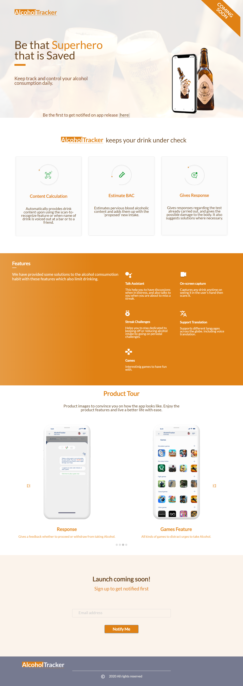

# Tracker

This project was generated with [Angular CLI](https://github.com/angular/angular-cli) version 10.0.2.

This is a website to show case a photographer's portfolio.

**Collaboration Instructions:**

    1. Clone this repository to your local PC.
    2. Your assets such as images, CSS file, JavaScript file should be placed in the Images, CSS, Javascript folders etc respectively in the src/assets directory.
    3. Use 90% botstrap for your styling.
    4. Ensure responsiveness in your designs. **Important** .
    5. Create a new branch locally name it according to the the instruction on the user story.
    7. Push your code to the repository.
    8. Make a Pull request for the master branch. 

## Design
    (https://www.figma.com/file/Rg1eRuZu3g7lkDczrLuSP9/supertrack?node-id=15%3A0)

##  Deployment

The application was deployed to netlify.

##  Built With

*  Angular
*  Bootstrap

##  Authors

* **Wendy Munyasi**  (https://github.com/wendymunyasi) - Slack Username: **@__wendy**

##  License

This project is licensed under the MIT License.

## Project-Setup Instructions.

1. git clone using the following links.

   link: https://github.com/wendymunyasi/tracker.git

2. Naviagte to the `photography-portfolio` directory.
3. Run `ng serve -o` on your terminal and a browser will open on `http://localhost:4200/ `automatically showing the landing page. 

## Code scaffolding

Run `ng generate component component-name` to generate a new component. You can also use `ng generate directive|pipe|service|class|guard|interface|enum|module`.

## Build

Run `ng build` to build the project. The build artifacts will be stored in the `dist/` directory. Use the `--prod` flag for a production build.

## Running unit tests

Run `ng test` to execute the unit tests via [Karma](https://karma-runner.github.io).

## Running end-to-end tests

Run `ng e2e` to execute the end-to-end tests via [Protractor](http://www.protractortest.org/).

## Further help

To get more help on the Angular CLI use `ng help` or go check out the [Angular CLI README](https://github.com/angular/angular-cli/blob/master/README.md).

## BDD

| Behaviour | Output |
| --------- | ------ |
|On loading the app you see the landing page showing various details about the photographer.|Not Applicable.|
|Clicking any link of the navigation bar.|You are redirected to the specific section of the page that you clicked.|

## Sample Screenshot of of the landing page

    

