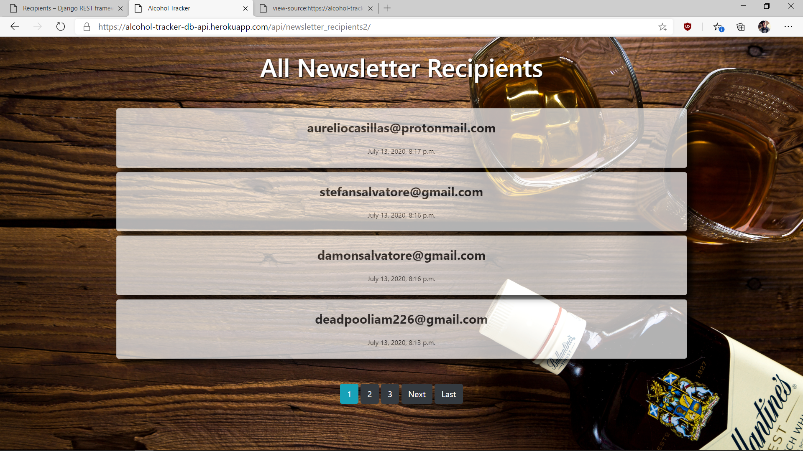

#  Alcohol Tracker App API.
This is an API for storing client's email address for an Alcohol Tracker app and built using Python and Django Rest Framework.

##  Getting Started

## Links

* **Website link for viewing recipients** - https://alcohol-tracker-db-api.herokuapp.com/api/newsletter_recipients2/

###  Prerequisites and Installing
You need to install the following software to have the app running on your local machine for development and testing purposes. Instructions on how to install will also be provided next to the software.

|Software|Installation Instructions/Terminal Commands|
|----------|---------------------------|
|Python3.6|1. sudo apt-get update|
|  |         2. sudo apt-get install python3.6|
|Pip|pip install --upgrade pip|
|Virtual Environment|1. pip install pipenv|
|   |2. Activate by running: pipenv shell|
|Django 3.0|pipenv install Django|
|All other dependencies| pipenv install --dev|

###  Running Tests

Examples of tests are given below.

####  NewsLetterRecipientTestCase

    def test_newsletter_recipient_instance(self):
        self.assertTrue(isinstance(self.new_newsletter_recipient, NewsLetterRecipient))

    The test above tests to see if a newsletter recipient instance was created correctly.

    def test_save_newsletter_recipient(self):
        self.test_newsletter_recipient = NewsLetterRecipient( email="damon@gmail.com")
        self.test_newsletter_recipient.save()
        newsletter_recipients = NewsLetterRecipient.objects.all().count()
        self.assertTrue(newsletter_recipients == 2)

    The test above tests to see if a newsletter recipient was saved correctly.

##  Deployment

Follow along with this document (https://gist.github.com/newtonkiragu/42f2500e56d9c2375a087233587eddd0) to deploy your application to Heroku.

##  Built With

*  [Django] - 3.0 (https://docs.djangoproject.com/en/3.0/)

##  Authors

* **Wendy Munyasi**

##  License

This project is licensed under the MIT License.

## Api Link and description

(https://alcohol-tracker-db-api.herokuapp.com/api/)

On loading the link above, a 404 page is displayed with the various urls.
You can visit any of the two urls apart from admin url.

## Project-Setup Instructions.

1.Open your github account and search for github username: **wendymunyasi**

1. git clone using the following links.

   link: https://github.com/wendymunyasi/BAC-tracker.git

2. For Django app, set the database to your own url then run `python3 manage.py makemigrations` and `python3 manage.py migrate`.
3. Run the command `python3 manage.py runserver`.
4. Click the local host link on your terminal  and navigate to the api root. Use the credentials provided to login if asked to do so.

## BDD

| Behaviour | Input | Output |
| ------------------------------ | ------| ------ |
|On loading the app you see the landing page displaying various email addresses from the database.|None |None|

 
## CODEBEAT

## The following include the list of technologies used:

  *  **Python3.6**
  *  **Django 3**
  *  **Bootstrap**
  *  **PostgreSQL**
  *  **Django Rest Framework**

## Collaborate

To colloborate, reach me through my email address wendymunyasi@gmail.com.

## Website Landing Page

